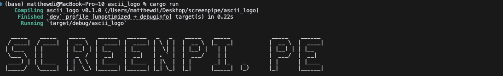

# ASCII_logo_in_rust
Print any logo for your tool in ASCII in Rust

## Get started

0. Clone the repo:

```bash
git clone https://github.com/m13v/ASCII_logo_in_rust.git
```

1. Navigate to the folder where you want the data to be stored
```bash
cd ASCII_logo_in_rust
```

2. Create any text passing input as a string. EXAMPLE:
```bash
cargo run -- SCREENPI.PE
```
Screenshot:

